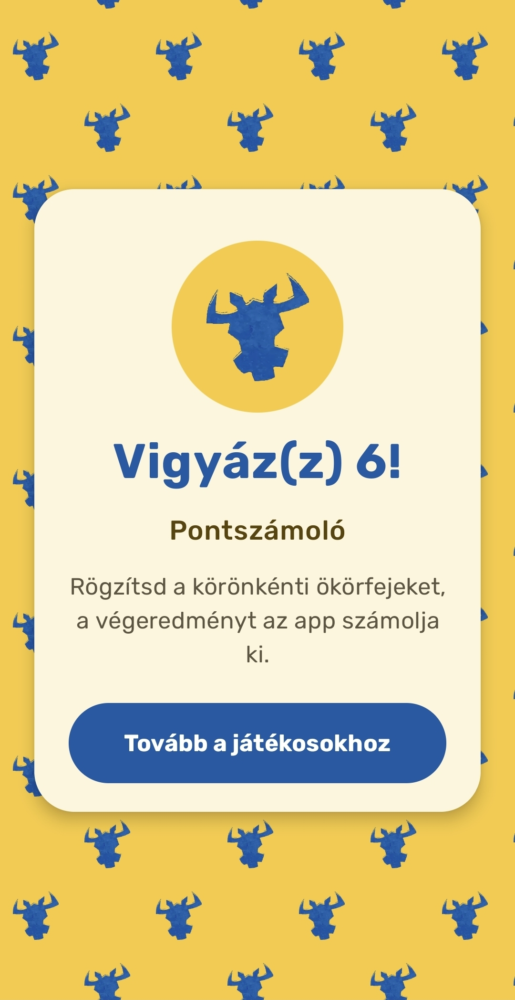
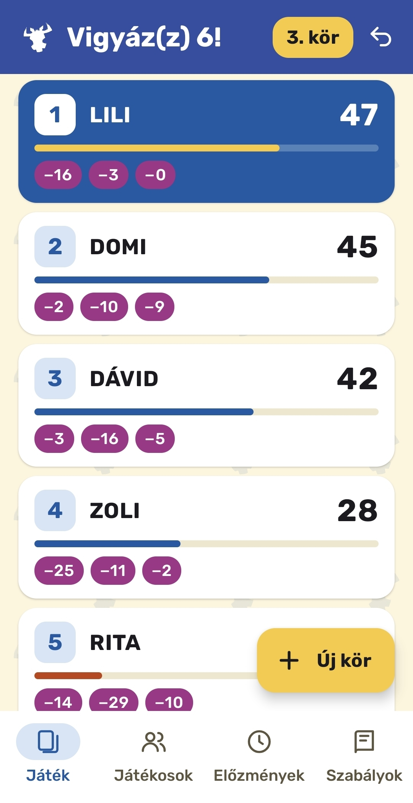
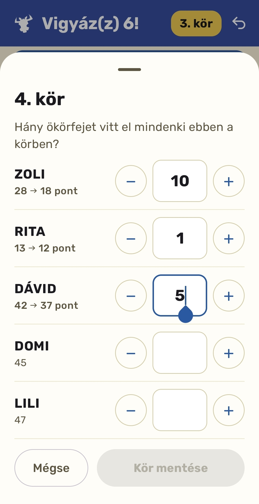
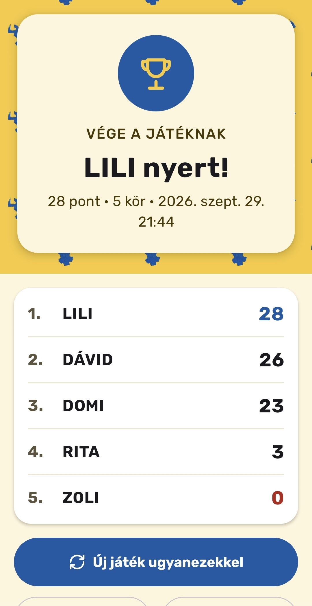
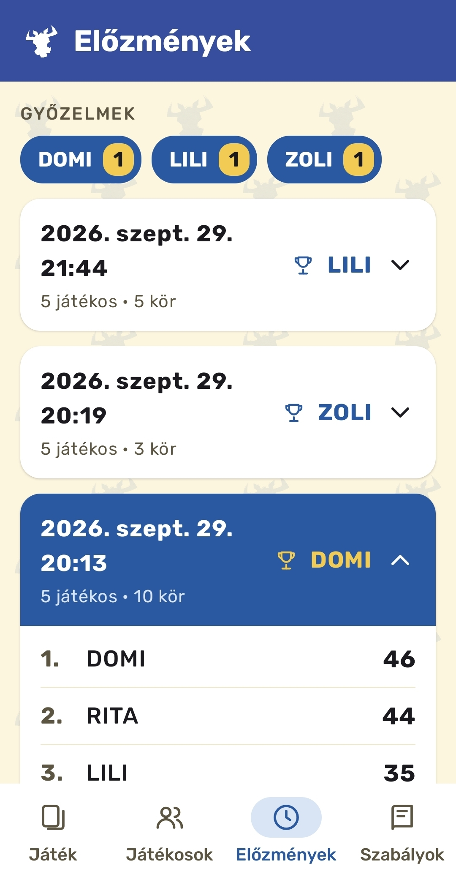

# Vigyáz(z) 6! – Pontszámoló Androidra

[English](README.md) | **Magyar**

Natív Android alkalmazás a **Vigyázz 6!** kártyajáték (nemzetközileg *6 nimmt!* / *Take 6!*) pontjainak vezetéséhez. Körönként beírod, hány ökörfejet vitt el egy-egy játékos, az app pedig levonja a pontokat, sorba rendezi a játékosokat, felismeri a játék végét, kiemeli a győztest és megőrzi az előzményeket.

Teljesen offline működik: az alkalmazásnak **nincs internet-engedélye**, nem gyűjt adatot, és nincs benne reklám.

> A Google Play megjelenés előkészítés alatt.

<p align="center">
  
  &nbsp;
  
  &nbsp;
  
  &nbsp;
  
  &nbsp;
  
</p>

## Funkciók

- **Névsor** – játékosok felvétele és törlése (2–10 fő). A névsor két játék között is megmarad, a korábban használt nevek egy koppintással visszavehetők.
- **Beállítható kezdőpont** – alapból 66, mindenki erről indul.
- **Pontbevitel egy lapon** – az összes játékos ültetési sorrendben, − / + gombokkal vagy számbillentyűzettel, az új pontszám azonnali előnézetével (pl. `28 → 18 pont`).
- **Figyelmeztetés a játék végére** – a pontbeviteli lap még mentés előtt jelzi, ha az adott körrel vége a játéknak.
- **Élő rangsor** – minden kör után animálva rendeződik át, holtversenyben azonos a helyezés, és minden kártyán látszanak a korábbi körök pontjai.
- **Visszavonás** – az utolsó kör törölhető, ha valaki elírta.
- **Játék vége képernyő** – a győztes (holtversenynél a győztesek), a végeredmény, *új játék ugyanezekkel*, és az eredmény megosztása szövegként bármelyik alkalmazásba.
- **Előzmények** – a befejezett játékok dátummal, győztessel és teljes végeredménnyel, valamint játékosonkénti győzelemszámláló.
- **Beépített játékszabály.**
- **Magyar, angol és német** felület, Android 13 felett alkalmazásonkénti nyelvválasztással.
- **A kijelző nem kapcsol ki**, amíg a Játék képernyő nyitva van.
- **Adaptív és témás indítóikon.**

## Adatvédelem

Minden adat (játékosok, körök, befejezett játékok) a készüléken, egy helyi Room adatbázisban tárolódik. Az alkalmazás nem kér internet-engedélyt, így semmi nem hagyhatja el a telefont. Adat csak akkor jut ki, ha a felhasználó maga osztja meg az eredményt az Android megosztási menüjével.

Adatvédelmi nyilatkozat: <https://zdomiter.github.io/vigyazz6/privacy.html>

## Technológiák

- Kotlin, Jetpack Compose, Material 3
- Room 2.8 (KSP-vel és exportált sémával)
- Navigation Compose
- ViewModel + StateFlow
- R8 kód- és erőforrás-optimalizálás a kiadási buildben
- minSdk 26 (Android 8.0), targetSdk 36 (Android 16), compileSdk 37

## Felépítés

Az alkalmazás nem a pontszámokat, hanem **a körönként elvitt ökörfejeket** tárolja. Egy játékos pontszáma mindig `kezdőpont − az ökörfejek összege`, így soha nem csúszhat el, a visszavonás pedig egyszerűen az utolsó kör sorainak törlése.

| Csomag | Tartalom |
|--------|----------|
| `data` | Room entitások (`roster`, `games`, `game_players`, `round_scores`), `GameDao`, `AppDatabase` |
| `game` | `GameLogic` – tiszta Kotlin pontszámítás, rangsorolás és ellenőrzés (unit tesztekkel); `GameViewModel` |
| `ui/welcome`, `ui/players`, `ui/game`, `ui/history`, `ui/rules` | Képernyők és ViewModeljeik |
| `ui/navigation` | Útvonalak, alsó sáv, az app váza |
| `ui/components` | Közös elemek: fejléc, mintás háttér, léptető gomb, automatikus méretű szöveg, megosztás, formázás |
| `ui/theme` | Színek, Rubik betűtípus, csempézett minta |

## Fordítás

1. Klónozd a repót, és nyisd meg Android Studióban:
   ```bash
   git clone https://github.com/zdomiter/vigyazz6_android.git
   ```
2. Futtasd az `app` konfigurációt telefonon vagy emulátoron (debug build, aláírás beállítása nélkül).
3. Unit tesztek futtatása:
   ```bash
   ./gradlew test
   ```

### Kiadási build

A kiadási aláírás a projekt gyökerében lévő `keystore.properties` fájlból olvassa az adatokat. Ez a fájl nincs a repóban, helyben kell létrehozni:

```properties
storeFile=C:/eleresi/ut/upload-key.jks
storePassword=...
keyAlias=upload
keyPassword=...
```

Utána: *Build → Generate Signed App Bundle or APK*.

## Kapcsolódó

Az eredeti webes változat: [zdomiter/vigyazz6_web](https://github.com/zdomiter/vigyazz6_web)

## Megjegyzés

Ez egy nem hivatalos, rajongói pontszámoló alkalmazás. A Vigyázz 6! (*6 nimmt!*) Wolfgang Kramer kártyajátéka, kiadója az AMIGO; a kapcsolódó védjegyek a jogtulajdonosokat illetik.

## Szerző

© 2026 Domiter Zoltán (Domitersoft) – Minden jog fenntartva.
